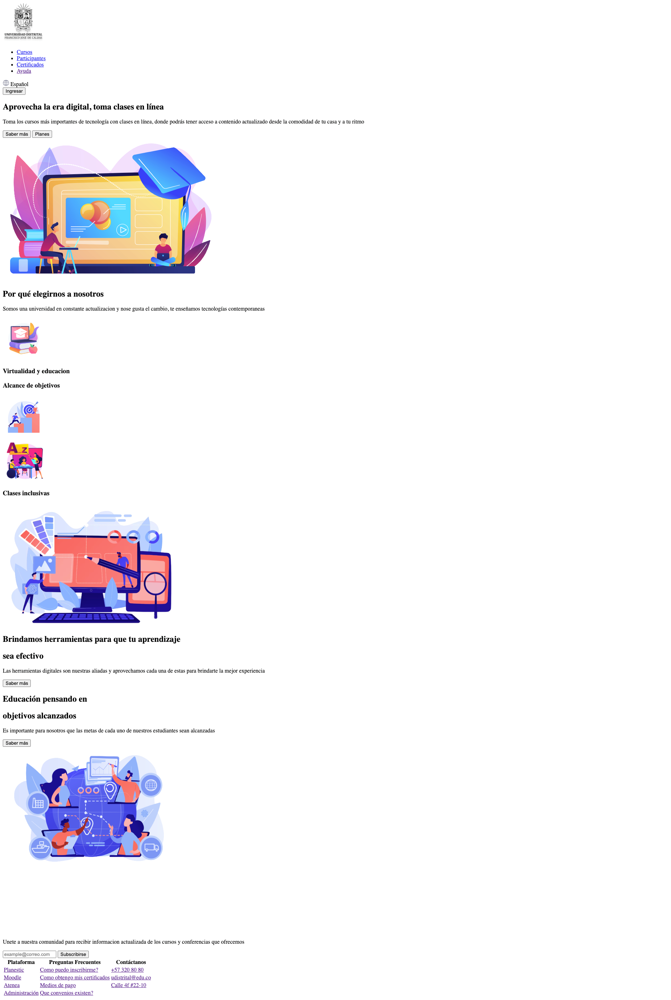
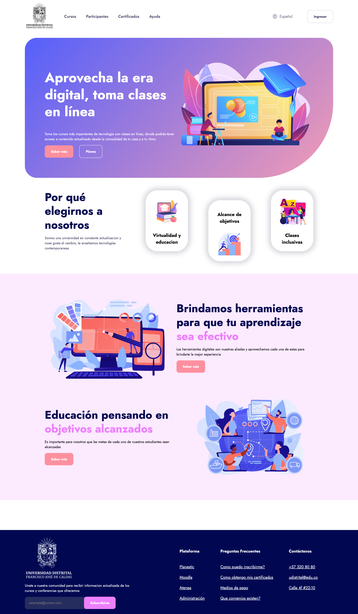

<h1>Taller 9 - Cristian Felipe Patiño Cáceres</h1>

<h2>Información</h2>

Curso: Full Stack Básico - Grupo 1

Profesor: Cristian Patiño

<h2>Link de la pagina Web</h2>
<a href="https://crissud.github.io/taller-9-full-stack-g1/">Link de Pagina Web</a>

<h2>Punto 1: Link de Figma</h2>
<a href="https://www.figma.com/file/sKguK1Awv4hmdZ7sHUGS0x/Example-WireFrame-%2F-Mockup-%2F-Design?type=design&node-id=0%3A1&mode=design&t=FrRTuOqXwkLPMUi4-1">Link de Figma</a>

<h2>Punto 2: Diseño en HTML</h2>

<h2>Punto 3: Diseño con CSS</h2>

<h2>Punto 4: Títulos</h2>

<h2>Punto 5: Párrafo</h2>

<h2>Punto 6: Links</h2>

<h2>Punto 7 y 8: Navegación</h2>

<h2>Punto 9: Tabla</h2>